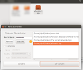

ncrptr uses javax.crypto library and can be opened as project on Netbeans IDE

 1. Drag&drop your files and/or directories
 

 
 2. Select and Encrypt them (If dirs were dropped, check the 'Compress' radio)
 

 3. Recover your files by pressing the De-convert button
 

